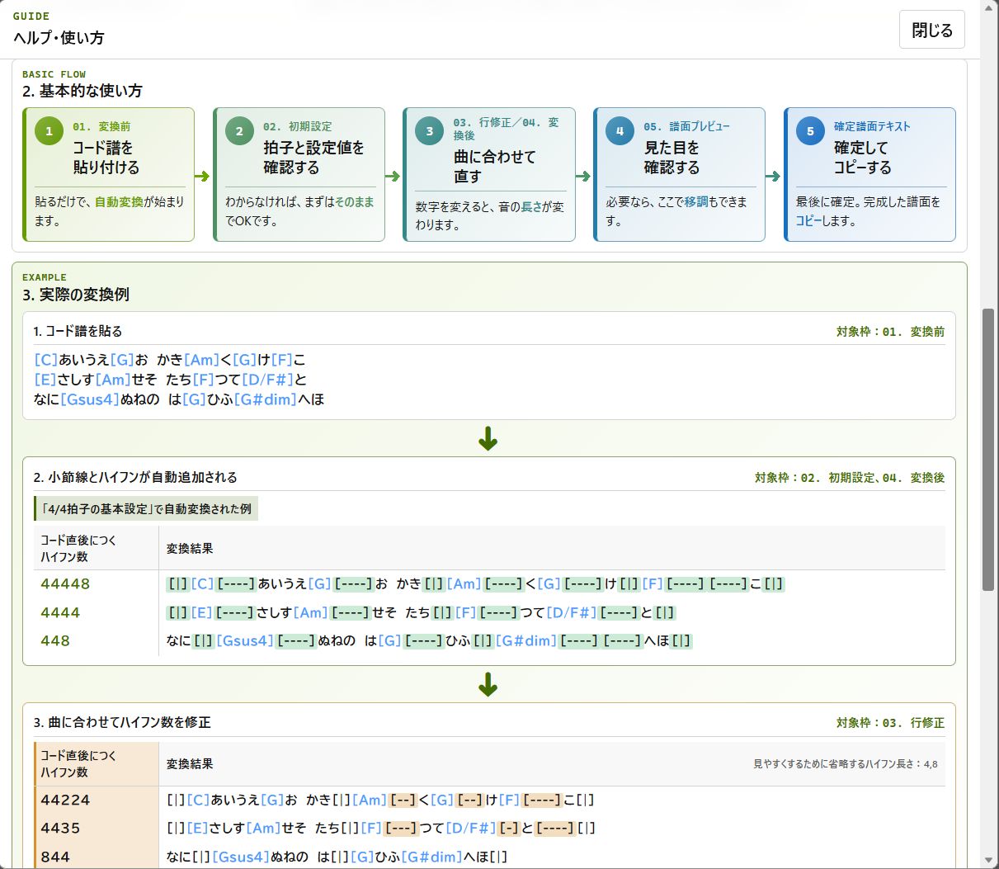
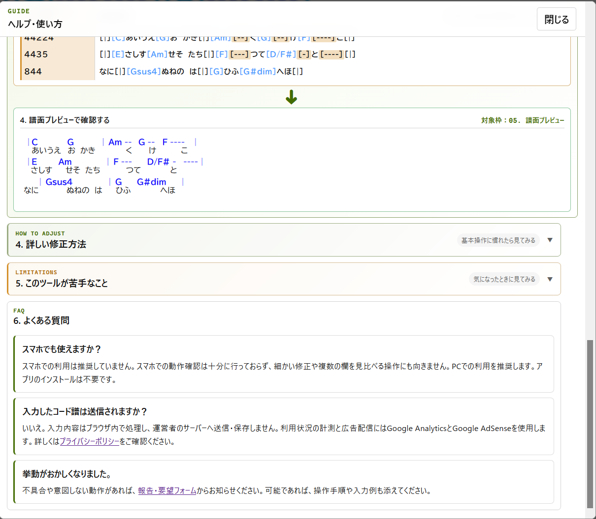

# ChordWiki Bar Formatter

> コード譜を貼る → 自動で整える → 譜面として確認する

ChordPro形式のコード譜へ、**小節線と音の長さを表す記号を自動で追加する**ブラウザーツールです。

**今すぐ使う：** [ChordWiki Bar Formatter](https://mapida222.github.io/ChordWiki-Bar-Formatter/)

| インストール不要 | 入力内容は外部送信なし | 変換から譜面確認までブラウザー内で完結 |
|---|---|---|

> [ChordWiki公式サイト](https://ja.chordwiki.org/)　非公式ツールです。

ChordWikiで使われるChordPro形式に対応しています。

## 目次

- [ヘルプ・使い方](#ヘルプ使い方)
- [リアルタイムエディター](#リアルタイムエディター)
- [主な機能](#主な機能)
- [データの扱い](#データの扱い)
- [対応環境](#対応環境)
- [開発とテスト](#開発とテスト)
- [管理IDとレイアウト基準](#管理idとレイアウト基準)
- [公開情報](#公開情報)

## ヘルプ・使い方

### 1. このツールについて

ChordWikiで使われるChordPro形式のコード譜に、小節線やリズム記号を追加し、演奏しやすく整えるブラウザーツールです。

コードと歌詞だけのテキストを貼り付けると、次のような変換を行います。

- 小節線とハイフンを自動追加
- 行修正欄でコードの長さを調整
- `^`（アクセント）、`@`（白玉）、`s`・`*s`（シンコペーション）を追加
- 譜面プレビューで確認しながら移調


たとえば、次の入力が小節線と長さ記号を含むChordPro形式へ変換されます。

```text
変換前： [C]コード譜を[G]貼り付けます
変換後： [|][C][----]コード譜を[G][----]貼り付けます[|]
```

### 2. 基本的な使い方

画面の番号に沿って、次の5段階で使います。

1. **01. 変換前：コード譜を貼り付ける**
   貼り付けるだけで自動変換が始まります。
2. **02. 初期設定：拍子と設定値を確認する**
   わからない場合は、まず初期値のままで試せます。
3. **03. 行修正／04. 変換後：曲に合わせて直す**
   曲と合わない行だけ、数字や記号を調整します。
4. **05. 譜面プレビュー：見た目を確認する**
   小節、コード、歌詞の並びを確認し、必要なら移調します。
5. **確定譜面テキスト：確定してコピーする**
   最後に確定した譜面をコピーします。



### 3. 実際の変換例

1. `01. 変換前`へChordPro形式のコード譜を貼り付けます。
2. `02. 初期設定`の拍子に合わせて自動変換します。
3. 曲と合わない箇所だけ、`03. 行修正`の数字や記号を上書きします。
4. `05. 譜面プレビュー`で、演奏時の見え方を確認します。

「01. 変換前」へChordPro形式のテキストを貼り付けます。
「03. 行修正」の数字や記号を調整します。
「05. 譜面プレビュー」で小節、コード、歌詞の見え方を確認します。



### 4. 詳しい修正方法

自動変換された結果を見て、曲と合わない行だけを修正します。

- `03. 行修正`の数字を変えると、そのコードの長さを調整できます。
- `^`、`@`、`s`、`*s`などの記号を使うと、アクセントや白玉、シンコペーションを指定できます。
- 行を更新した後は、`04. 変換後`と`05. 譜面プレビュー`で結果を確認します。
- 変換前のコードや歌詞を直した場合は、変換前の欄で編集してから結果を確認します。

### 5. このツールが苦手なこと

- スマートフォンでは、細かい修正や複数の欄の見比べがしにくいため、PCでの利用を推奨します。
- ChordPro形式から外れた入力や複雑な手入力リズムは、自動変換だけで意図どおりにならない場合があります。
- 自動変換後は、曲と譜面プレビューを見比べ、必要な行だけ手動で調整してください。

### 6. よくある質問

#### スマホでも使えますか？

スマートフォンでの利用は推奨していません。細かい修正や複数の欄を見比べる操作には、PCでの利用を推奨します。アプリのインストールは不要です。

#### 入力したコード譜は送信されますか？

いいえ。入力内容はブラウザー内で処理し、運営者のサーバーへ送信・保存しません。利用状況の計測と広告配信にはGoogle AnalyticsとGoogle AdSenseを使用します。詳しくは[プライバシーポリシー](https://mapida222.github.io/ChordWiki-Bar-Formatter/privacy.html)をご確認ください。

#### 挙動がおかしくなりました。

不具合や意図しない動作があれば、[報告・要望フォーム](https://docs.google.com/forms/d/e/1FAIpQLScYAHIEEOtuk8MoQR_1sNN7SVgCFFRtKCeUkm23sqTIGqg-cQ/viewform)からお知らせください。可能であれば、操作手順や入力例も添えてください。

## リアルタイムエディター

「リアルタイムエディターで開く」から、編集テキストと譜面プレビューを並べて確認できます。入力内容はリアルタイムで反映され、譜面側の行をクリックすると対応する編集行を確認できます。


## 主な機能

- コード譜への小節線と長さ記号の追加
- 行単位の長さ修正と小節位置の調整
- コード譜のプレビュー
- 移調とシャープ・フラット表記の切り替え
- 変換前の小節幅と初期設定が異なる場合の警告
- 歌詞行のハイフン省略方法の選択
- 編集履歴とクラッシュ復元
- ライトテーマとダークテーマ
- 画面幅に応じたレイアウト

## データの扱い

変換処理はブラウザー内で完結します。このアプリ自身は、入力したコード譜や設定を外部サーバーへ送信しません。

作業を復元するため、次の情報をブラウザーの`localStorage`へ保存します。

- 初期設定と表示設定
- 変換前テキスト
- 行修正テキストと行ごとの採用状態
- 確定譜面テキスト
- 編集履歴とクラッシュ復元データ

保存内容は同じブラウザーと同じ公開元で利用されます。ブラウザーのサイトデータを削除すると、保存内容も削除されます。

保存形式の所有範囲、互換性、状態追加時の確認箇所は[保存データschema契約](docs/SAVED_DATA_SCHEMA.md)にまとめています。

コード譜や歌詞を公開または共有するときは、利用者が権利関係を確認してください。

## 対応環境

最新版のFirefox、Google Chrome、Microsoft Edgeを推奨します。クリップボード操作は、ブラウザーの権限設定や公開方法によって制限される場合があります。

ローカルファイルとして開くだけで動作します。静的Webサーバーへ配置した場合も同じ機能を利用できます。

## 開発とテスト

Node.js 20.19以上を用意し、リポジトリのルートで次を実行します。

```sh
npm install
npm run dev
npm test
npm run build
npm run preview
```

`npm run dev`は開発サーバー、`npm run build`はGitHub Pages用の`dist/`、`npm run preview`はその成果物の確認用サーバーを起動します。

テストは`tests`内の全ファイル、公式ChordWiki Parserとの統合、主要JavaScriptの構文を検査します。依存関係は`package-lock.json`で固定しています。

プレビューは公式[`@chordwiki/chordpro-parser`](https://github.com/ChordWiki/chordpro-parser)でChordWiki方言を解析し、Formatter固有記法のAdapterを経由して旧ChordWiki表示Rendererへ渡します。変換エンジンと保存形式はこの表示処理から独立しています。

Python版との共通回帰ケースは`tests/fixtures/v45-regressions.json`で管理します。

## 管理IDとレイアウト基準

修正箇所と確認項目は[管理ID台帳](MANAGEMENT_IDS.md)で管理します。チャットやGitコミットで同じIDを使うため、変更の対象を追跡できます。

譜面プレビューの基準は[レイアウト設定書](LAYOUT_REFERENCE.md)と`PREVIEW-001`に記録しています。保存済みの状態は`layout-snapshots/2026-07-22-good/`にあります。

今回の責務分離、`wiki.cgi`の分析、復元方法は[リファクタリング設計書](docs/REFACTORING.md)に記録しています。

## 公開情報

[公開チェックリスト](PUBLICATION_CHECKLIST.md)を参照してください。公開先は[GitHub Pages](https://mapida222.github.io/ChordWiki-Bar-Formatter/)です。更新履歴と配布情報は[Releases](https://github.com/mapida222/ChordWiki-Bar-Formatter/releases)で公開します。このソフトウェアは[MIT License](LICENSE)で公開しています。
