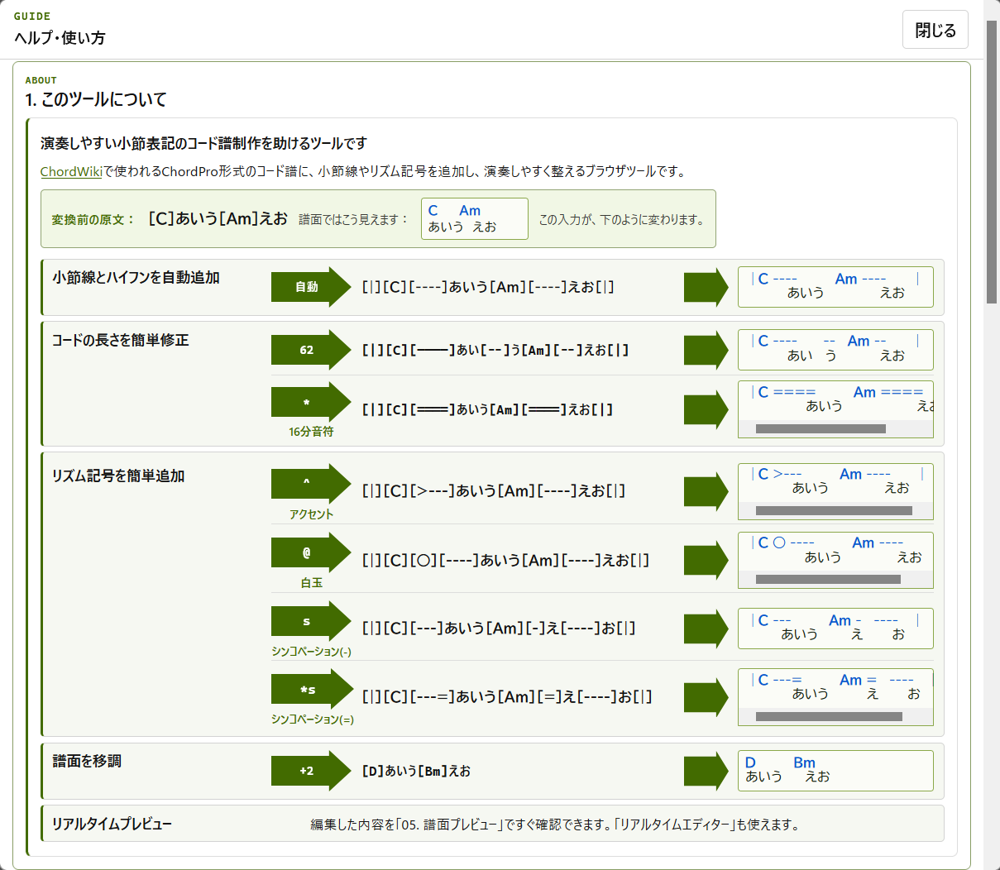
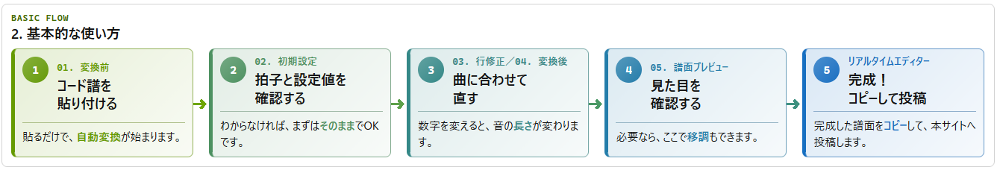
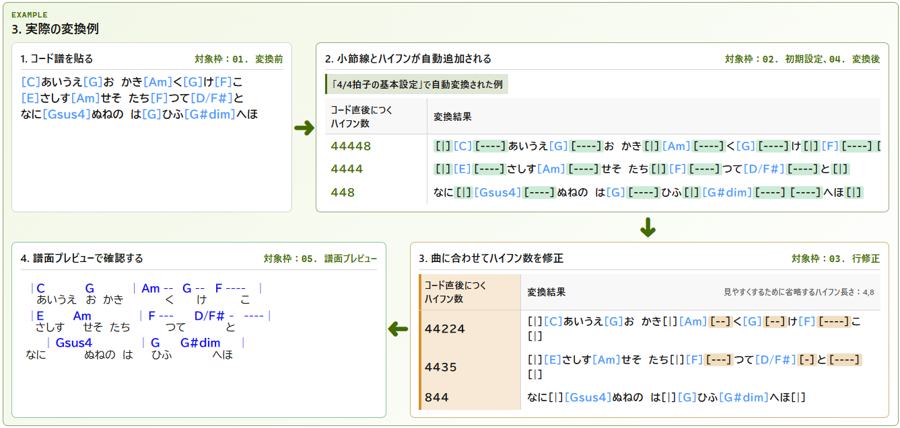
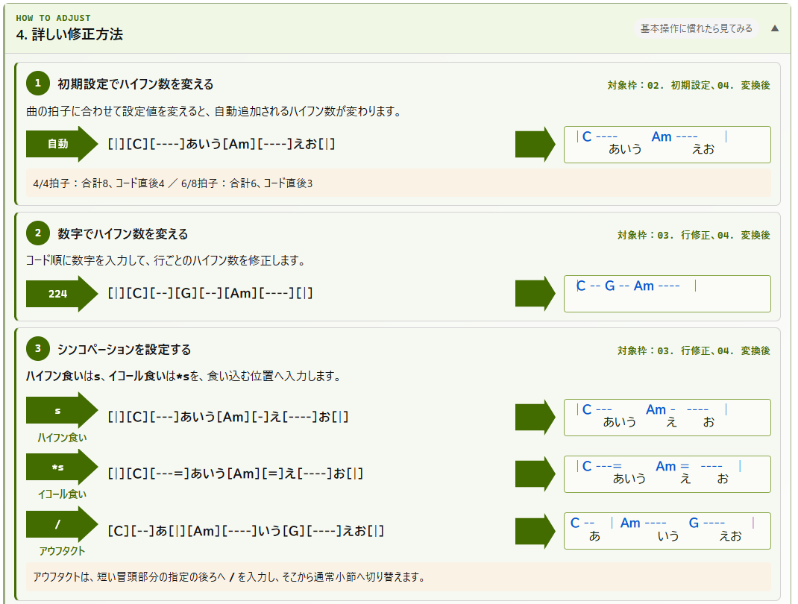
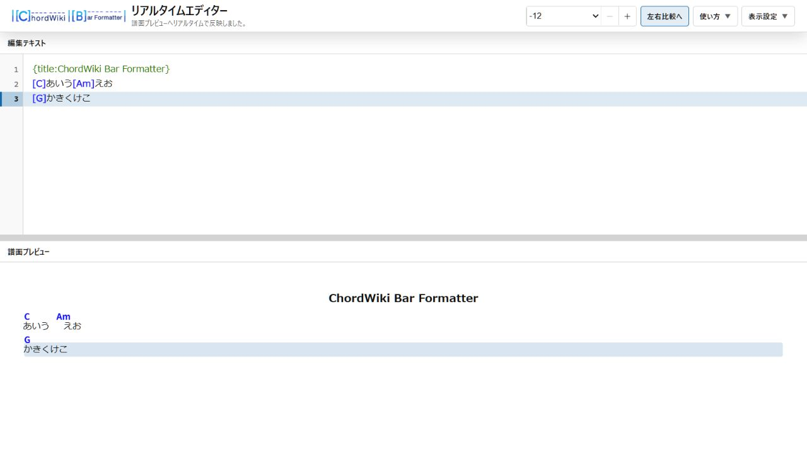

# ChordWiki Bar Formatter

ChordPro形式のコード譜へ、**小節線と音の長さを表す記号を自動で追加する**ブラウザーツールです。

① コード譜を貼る

② 自動で整える

③ 譜面として確認する



インストール不要、ブラウザー使用、ChordWiki非公式ツールです。

**今すぐ使う：** [ChordWiki Bar Formatter](https://mapida222.github.io/ChordWiki-Bar-Formatter/)

## 目次

- [使い方](#使い方)
- [基本的な使い方](#基本的な使い方)
- [実際の変換例](#実際の変換例)
- [詳しい修正方法](#詳しい修正方法)
- [リアルタイムエディター](#リアルタイムエディター)
- [主な機能](#主な機能)
- [データの扱い](#データの扱い)
- [対応環境](#対応環境)
- [開発とテスト](#開発とテスト)
- [管理IDとレイアウト基準](#管理idとレイアウト基準)
- [公開情報](#公開情報)

## 使い方

### 基本的な使い方



- コード譜を貼り付ける
- 初期設定を確認する
- 曲に合わせて行を修正し、譜面を確認する
- 完成した譜面をコピーして投稿する

### 実際の変換例



- 変換前のコード譜を貼り付ける
- 小節線とハイフンが自動追加される
- 行修正でハイフン数を曲に合わせる
- 譜面プレビューで確認する

### 詳しい修正方法



- 初期設定で小節のハイフン数を変える
- 行修正で数字を入力してハイフン数を変える
- `s`、`*s`、`/`でシンコペーションや小節位置を調整する

## リアルタイムエディター



- 編集テキストと譜面プレビューを並べて確認
- 編集内容をリアルタイムで譜面へ反映
- 譜面側の行をクリックして対応する編集行を確認

## 主な機能

- コード譜への小節線と長さ記号の追加
- 行単位の長さ修正と小節位置の調整
- コード譜のプレビュー
- 移調とシャープ・フラット表記の切り替え
- 変換前の小節幅と初期設定が異なる場合の警告
- 歌詞行のハイフン省略方法の選択
- 編集履歴とクラッシュ復元
- ライトテーマとダークテーマ
- 画面幅に応じたレイアウト

## データの扱い

変換処理はブラウザー内で完結します。このアプリ自身は、入力したコード譜や設定を外部サーバーへ送信しません。

作業を復元するため、次の情報をブラウザーの`localStorage`へ保存します。

- 初期設定と表示設定
- 変換前テキスト
- 行修正テキストと行ごとの採用状態
- 確定譜面テキスト
- 編集履歴とクラッシュ復元データ

保存内容は同じブラウザーと同じ公開元で利用されます。ブラウザーのサイトデータを削除すると、保存内容も削除されます。

保存形式の所有範囲、互換性、状態追加時の確認箇所は[保存データschema契約](docs/SAVED_DATA_SCHEMA.md)にまとめています。

コード譜や歌詞を公開または共有するときは、利用者が権利関係を確認してください。

## 対応環境

最新版のFirefox、Google Chrome、Microsoft Edgeを推奨します。クリップボード操作は、ブラウザーの権限設定や公開方法によって制限される場合があります。

ローカルファイルとして開くだけで動作します。静的Webサーバーへ配置した場合も同じ機能を利用できます。

## 開発とテスト

Node.js 20.19以上を用意し、リポジトリのルートで次を実行します。

```sh
npm install
npm run dev
npm test
npm run build
npm run preview
```

`npm run dev`は開発サーバー、`npm run build`はGitHub Pages用の`dist/`、`npm run preview`はその成果物の確認用サーバーを起動します。

テストは`tests`内の全ファイル、公式ChordWiki Parserとの統合、主要JavaScriptの構文を検査します。依存関係は`package-lock.json`で固定しています。

プレビューは公式[`@chordwiki/chordpro-parser`](https://github.com/ChordWiki/chordpro-parser)でChordWiki方言を解析し、Formatter固有記法のAdapterを経由して旧ChordWiki表示Rendererへ渡します。変換エンジンと保存形式はこの表示処理から独立しています。

Python版との共通回帰ケースは`tests/fixtures/v45-regressions.json`で管理します。

## 管理IDとレイアウト基準

修正箇所と確認項目は[管理ID台帳](MANAGEMENT_IDS.md)で管理します。チャットやGitコミットで同じIDを使うため、変更の対象を追跡できます。

譜面プレビューの基準は[レイアウト設定書](LAYOUT_REFERENCE.md)と`PREVIEW-001`に記録しています。保存済みの状態は`layout-snapshots/2026-07-22-good/`にあります。

今回の責務分離、`wiki.cgi`の分析、復元方法は[リファクタリング設計書](docs/REFACTORING.md)に記録しています。

## 公開情報

[公開チェックリスト](PUBLICATION_CHECKLIST.md)を参照してください。公開先は[GitHub Pages](https://mapida222.github.io/ChordWiki-Bar-Formatter/)です。更新履歴と配布情報は[Releases](https://github.com/mapida222/ChordWiki-Bar-Formatter/releases)で公開します。このソフトウェアは[MIT License](LICENSE)で公開しています。
