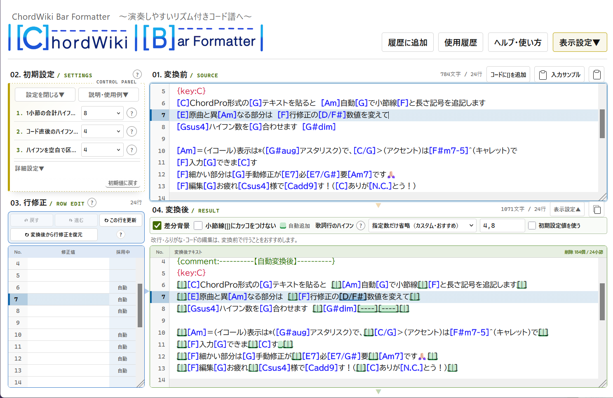
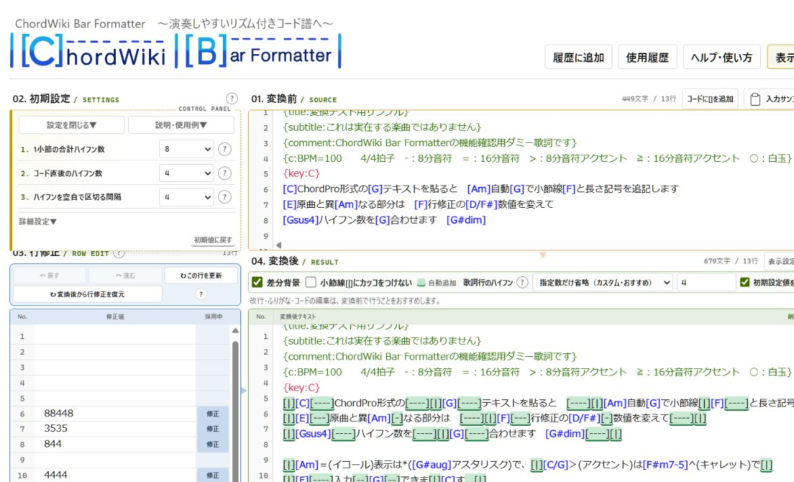
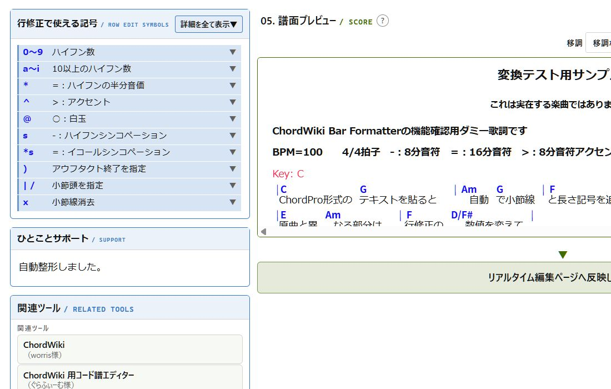
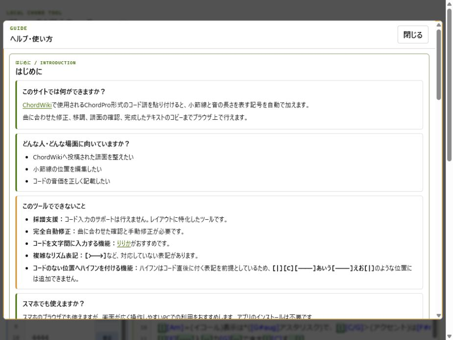

# ChordWiki Bar Formatter

> コード譜を貼る → 自動で整える → 譜面として確認する

ChordPro形式のコード譜へ、**小節線と音の長さを表す記号を自動で追加する**ブラウザーツールです。

**今すぐ使う：** [ChordWiki Bar Formatter](https://mapida222.github.io/ChordWiki-Bar-Formatter/)

| インストール不要 | 入力内容は外部送信なし | 変換から譜面確認までブラウザー内で完結 |
|---|---|---|

> [ChordWiki公式サイト](https://ja.chordwiki.org/)　非公式ツールです。

## 目次

- [まずは完成イメージ](#まずは完成イメージ)
- [3ステップで使う](#3ステップで使う)
- [リアルタイム編集ページ](#リアルタイム編集ページ)
- [画面で見る](#画面で見る)
- [詳しい使い方](#詳しい使い方)
- [主な機能](#主な機能)
- [データの扱い](#データの扱い)
- [対応環境](#対応環境)
- [開発とテスト](#開発とテスト)
- [管理IDとレイアウト基準](#管理idとレイアウト基準)
- [公開情報](#公開情報)

## まずは完成イメージ

コードと歌詞だけのテキストを貼り付けると、小節線と音の長さを表す記号を補います。

```text
変換前： [C]コード譜を[G]貼り付けます
変換後： [|][C][----]コード譜を[G][----]貼り付けます[|]
```

曲に合わない箇所は、行修正欄の数字や記号を上書きして調整し、最後に譜面プレビューで確認します。

## 3ステップで使う

### 1. コード譜を貼る

「01. 変換前」へChordPro形式のテキストを貼り付けます。迷った場合は、画面の「入力サンプル」から試せます。



### 2. 曲に合わせて直す

自動変換された結果を見て、曲と合わない行だけ「03. 行修正」の数字や記号を調整します。



### 3. 譜面で確認して確定する

「05. 譜面プレビュー」で小節、コード、歌詞の見え方を確認します。必要なら移調し、「譜面プレビューを確定」してコピーします。



## リアルタイム編集ページ

「別画面で開く」から、編集テキストと譜面プレビューを並べて確認できます。入力内容はリアルタイムで反映され、譜面側の行をクリックすると対応する編集行を確認できます。


## 画面で見る

操作の流れを画面全体で確認できます。



## 詳しい使い方

1. 公開URL、または`npm run dev`で起動した開発URLをブラウザーで開きます。
2. 「01. 変換前」へChordPro形式のコード譜を貼り付けます。
3. 必要に応じて「02. 初期設定」を曲の拍子に合わせます。
4. 曲と合わない箇所を「03. 行修正」で調整します。
5. 「05. 譜面プレビュー」で表示を確認します。
6. 「譜面プレビューを確定」を押し、「確定譜面テキスト」からコピーします。

迷った場合は、画面右上の「ヘルプ・使い方」で具体例を確認できます。

## 主な機能

- コード譜への小節線と長さ記号の追加
- 行単位の長さ修正と小節位置の調整
- コード譜のプレビュー
- 移調とシャープ・フラット表記の切り替え
- 変換前の小節幅と初期設定が異なる場合の警告
- 歌詞行のハイフン省略方法の選択
- 編集履歴とクラッシュ復元
- ライトテーマとダークテーマ
- 画面幅に応じたレイアウト

## データの扱い

変換処理はブラウザー内で完結します。このアプリ自身は、入力したコード譜や設定を外部サーバーへ送信しません。

作業を復元するため、次の情報をブラウザーの`localStorage`へ保存します。

- 初期設定と表示設定
- 変換前テキスト
- 行修正テキストと行ごとの採用状態
- 確定譜面テキスト
- 編集履歴とクラッシュ復元データ

保存内容は同じブラウザーと同じ公開元で利用されます。ブラウザーのサイトデータを削除すると、保存内容も削除されます。

保存形式の所有範囲、互換性、状態追加時の確認箇所は[保存データschema契約](docs/SAVED_DATA_SCHEMA.md)にまとめています。

コード譜や歌詞を公開または共有するときは、利用者が権利関係を確認してください。

## 対応環境

最新版のFirefox、Google Chrome、Microsoft Edgeを推奨します。
クリップボード操作は、ブラウザーの権限設定や公開方法によって制限される場合があります。

ローカルファイルとして開くだけで動作します。静的Webサーバーへ配置した場合も同じ機能を利用できます。

## 開発とテスト

Node.js 20.19以上を用意し、リポジトリのルートで次を実行します。

```sh
npm install
npm run dev
npm test
npm run build
npm run preview
```

`npm run dev`は開発サーバー、`npm run build`はGitHub Pages用の`dist/`、`npm run preview`はその成果物の確認用サーバーを起動します。

テストは`tests`内の全ファイル、公式ChordWiki Parserとの統合、主要JavaScriptの構文を検査します。依存関係は`package-lock.json`で固定しています。

プレビューは公式[`@chordwiki/chordpro-parser`](https://github.com/ChordWiki/chordpro-parser)でChordWiki方言を解析し、Formatter固有記法のAdapterを経由して旧ChordWiki表示Rendererへ渡します。変換エンジンと保存形式はこの表示処理から独立しています。

Python版との共通回帰ケースは`tests/fixtures/v45-regressions.json`で管理します。

## 管理IDとレイアウト基準

修正箇所と確認項目は[管理ID台帳](MANAGEMENT_IDS.md)で管理します。
チャットやGitコミットで同じIDを使うため、変更の対象を追跡できます。

譜面プレビューの基準は[レイアウト設定書](LAYOUT_REFERENCE.md)と`PREVIEW-001`に記録しています。
保存済みの状態は`layout-snapshots/2026-07-22-good/`にあります。

今回の責務分離、`wiki.cgi`の分析、復元方法は[リファクタリング設計書](docs/REFACTORING.md)に記録しています。

## 公開情報

[公開チェックリスト](PUBLICATION_CHECKLIST.md)を参照してください。
公開先は[GitHub Pages](https://mapida222.github.io/ChordWiki-Bar-Formatter/)です。
更新履歴と配布情報は[Releases](https://github.com/mapida222/ChordWiki-Bar-Formatter/releases)で公開します。
このソフトウェアは[MIT License](LICENSE)で公開しています。
